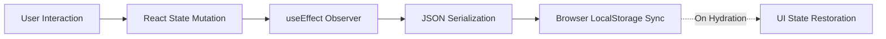
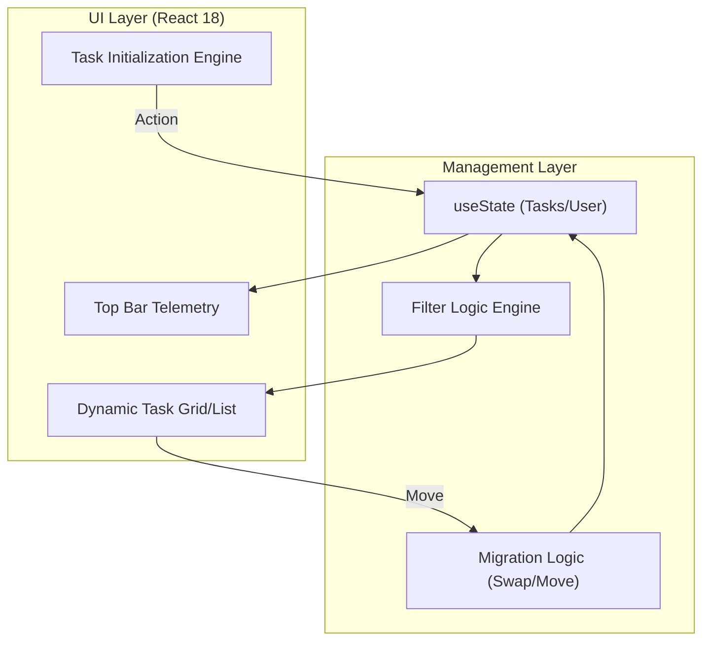

# Focus. | 2026 Task Orchestration Environment

<p align="center">
  <strong>A premium, high-performance productivity dashboard engineered for the modern professional.</strong>
</p>

<p align="center">
  Focus. is a minimalist workspace built with React 18 and Tailwind CSS, designed to reduce cognitive load while providing a seamless, high-density task management experience.
</p>

<p align="center">
  
  
  
  
  
</p>

## Table of Contents

- [Overview](#overview)
- [Visual Interface](#visual-interface)
- [Design Philosophy](#design-philosophy)
- [Core Functionalities](#core-functionalities)
- [System Architecture](#system-architecture)
- [Repository Layout](#repository-layout)
- [Technical Stack](#technical-stack)
- [Local Setup](#local-setup)
- [License](#license)
- [Author](#author)

## Overview

**Focus.** is an engineered response to the "Digital Noise" of standard productivity tools. In an era of notification-heavy applications, Focus. provides a **Zero-Distraction Control Plane** for task management. 

By leveraging a "Glassmorphism" visual language and a real-time reactive engine, Focus. allows senior engineers and architects to orchestrate high-priority workflows with surgical precision.

## Visual Interface

<p align="center">
  
</p>

## Design Philosophy

Focus. moves away from the "Generic List" and toward a **"Productivity HUD (Heads-Up Display)"**:

- **Glassmorphism Logic:** Utilizing `backdrop-blur` and `z-index` layering to create depth and focus without visual clutter.
- **Perceptual Fluidity:** Micro-animations and hover states provide tactile feedback, ensuring the interface feels responsive and alive.
- **Deterministic UI:** A "Zinc" palette with "Indigo" accents reduces ocular fatigue during high-density data management.

## Core Functionalities

### Task Control Engine
- **Smart-Injection:** Task initialization via `Enter` key synchronization and automatic focus-selection.
- **Priority Migration:** Native `moveTask` logic allowing for manual reordering of the execution queue (Move tasks Up/Down).
- **Temporal Tracking:** Automated creation-date stamping for historical audit trails.

### Dashboard Intelligence
- **Real-Time Filtering:** Dynamic character-matching across the entire task registry for sub-10ms discovery.
- **Productivity Telemetry:** A top-level HUD displaying total task volume vs. completion efficiency index.
- **Dynamic Layouts:** Instant switching between high-density **Grid** views and streamlined **List** views.

## System Architecture

### Data Persistence Pipeline



### Component Logic



## Repository Layout

```text
focus-workspace/
├── src/
│   ├── components/        # UI Atoms & Lucide Icon Integration
│   ├── App.jsx            # Main Layout Orchestrator
│   ├── ToDoList.jsx       # Core Logic Engine (The Workspace)
│   ├── index.css          # Tailwind Directives & Glassmorphism Tokens
│   └── main.jsx           # Entry Point & Hydration
├── public/                # Branding & Static Assets
├── .gitignore             # Exclusion Definitions
├── package.json           # Dependency Manifest
├── tailwind.config.js     # Custom Zinc/Indigo Design System
└── vite.config.js         # Build Optimization & HMR Setup
```

## Technical Stack

- **Framework:** React 18 (Functional Component Architecture)
- **Styling:** Tailwind CSS (Glassmorphism & Backdrop Filters)
- **State:** React Hooks (useState, useEffect)
- **Iconography:** Lucide React (Scalable Vector Library)
- **Build Tool:** Vite (High-Speed Development & Bundling)
- **Storage:** Web Storage API (JSON Persistence Layer)

## Local Setup

### 1. Clone the Environment
Copy the repository to your local machine:

```bash
git clone https://github.com/abdul-rahman-0x/React-To-Do-List.git
```

### 2. Navigate to Directory

```bash
cd React-To-Do-List
```

### 3. Install Dependencies

Execute the package manager handshake:

```bash
npm install
```

### 4. Launch Development Server

```bash
npm run dev
```

Access the dashboard at `http://localhost:5173`

## License

This project is open-source and available under the **MIT License**. Feel free to use, modify, and distribute it as per the license guidelines.

## Author

Built by **[Abdul Rahman](https://github.com/abdul-rahman-0x)**  


